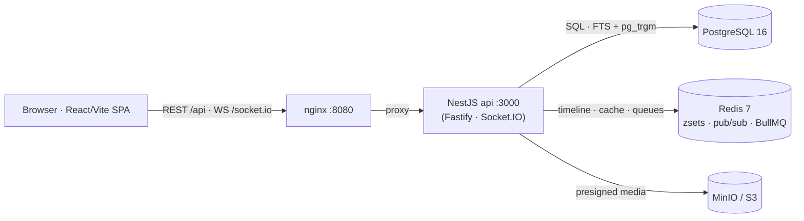

<div align="center">


# PULSE

**A real-time, Twitter-style microblogging platform** — _post · follow · message · trend_

[](https://github.com/mitekk/pulse/actions/workflows/ci.yml)
[](LICENSE)


A **production-shaped** microblogging reference implementation: a NestJS modular monolith, a
React/Vite single-page app, and real-time delivery over WebSockets — the whole stack lifts with
**one command** in Docker. It implements the social mechanics of a feed app (posts, replies,
threads, reposts/quotes, follows, likes, bookmarks, DMs, notifications, search, hashtags, trends)
on top of a Redis fan-out timeline.

</div>

---

- **Explore** — [What it is](#what-it-is) · [What you can do](#what-you-can-do) · [Quick start](#quick-start) · [Architecture](#architecture) · [Tech stack](#tech-stack) · [Testing](#testing) · [CI](#continuous-integration) · [Configuration](#configuration) · [Technical highlights](#technical-highlights) · [Docs](#docs--decisions)

---

## What it is

PULSE is a full-featured v1 microblogging platform built as a **production-shaped** reference
implementation. The backend is a single deployable NestJS modular monolith (Fastify adapter); the
frontend is a React/Vite SPA; real-time updates ride a Socket.IO gateway with a Redis pub/sub
adapter. Home timelines are precomputed per user as capped Redis sorted sets, with fan-out running
async on BullMQ. `docker compose up --build` lifts the whole stack — web, API, Postgres, Redis,
and MinIO — and CI runs the full `lint → unit → integration → e2e → build` pipeline.

## What you can do

- **Post & reply** — share posts up to 280 characters; reply to anyone and read the whole conversation as a threaded view.
- **Repost & quote** — boost a post to your followers, or quote it with your own commentary.
- **Follow people — or lock your account** — build a follow graph, or set your account **private** so new followers need approval. Block and mute to curate what you see.
- **Like & bookmark** — react to posts and privately save them for later.
- **A timeline that updates live** — your home feed assembles from the people you follow, and a "N new posts" pill appears in real time as they post.
- **Direct messages** — 1:1 conversations with typing indicators and read receipts, delivered instantly.
- **Notifications** — likes, follows, replies, mentions, and reposts, aggregated, with a live unread badge.
- **Search & explore** — find posts and people across **Top / Latest / People / Media**, browse hashtag timelines, and see what's trending.
- **Profiles & media** — a customizable profile (avatar, banner, bio) and image/video attachments processed through a media pipeline.

## Quick start

```bash
cp .env.example .env        # dev placeholders work out of the box
docker compose up --build   # builds + lifts the whole stack
```

| Service  | URL / Port                           | Notes                                                               |
|----------|--------------------------------------|---------------------------------------------------------------------|
| Frontend | <http://localhost:8080>              | nginx serving the SPA; proxies `/api` + `/socket.io` to the backend |
| Backend  | <http://localhost:3000/api/v1>       | REST + WebSocket gateway; `GET /health`                             |
| Postgres | `localhost:5432`                     | data in the `db_data` volume                                        |
| Redis    | `localhost:6379`                     | cache · home zsets · pub/sub · BullMQ                               |
| MinIO    | <http://localhost:9000> (console 9001) | object storage for media                                          |

Open **<http://localhost:8080>**, register an account, and post.

> **Requirements:** Docker + Docker Compose. `docker compose up` is the supported path; Node is
> pinned to **24.16.0** (`.nvmrc`) for any host-side tooling.

`docker compose up` automatically loads
[`docker-compose.override.yml`](docker-compose.override.yml) for hot reload — `nest start --watch`
on the backend and Vite HMR (port **5173**) on the frontend, no rebuild on code change. Common
[`make`](Makefile) targets: `make up` / `make down` / `make dev` / `make test` / `make migrate`.

## Architecture

The browser talks to nginx, which serves the SPA and reverse-proxies `/api` (REST) and
`/socket.io` (WebSocket) to the NestJS backend. The backend reads/writes Postgres, precomputes
home timelines as capped Redis sorted sets (fan-out async on BullMQ), and fans real-time events
across instances through a Socket.IO + Redis pub/sub adapter. Media uploads go direct-to-storage
via presigned URLs to MinIO/S3.



```
backend/    NestJS modular monolith (modules: auth, users, posts, timeline, engagement,
            media, messaging, notifications, search, hashtags, realtime; common/, infra/)
frontend/   React SPA (app/, lib/{api,realtime,cache,auth}, features/, components/, hooks/)
docs/       PRD, architecture, API contract, ADRs, scaffold state, phase summaries
tests/      integration + e2e (Playwright)
.github/    CI workflows
```

See [`docs/architecture.md`](docs/architecture.md) for the full topology and module layout.

## Tech stack

| Layer | Tech |
|---|---|
| Backend | NestJS 11 (Fastify adapter) · TypeORM · BullMQ · Socket.IO (Redis adapter) · argon2 |
| Frontend | React 19 + Vite + TypeScript · TanStack Query · Zustand · React Router · React Hook Form + Zod · Tailwind |
| Data | PostgreSQL 16 (FTS + `pg_trgm`) · Redis 7 · MinIO / S3 |
| Runtime | Node 24.16 · Docker Compose · Turborepo · nginx |
| Quality | Vitest · Playwright · ESLint + Prettier · Lighthouse CI · size-limit |

## Testing

```bash
make test                # unit tests, all packages   (= turbo run test)
make test-integration    # backend integration (host-run vs dockerized db/redis on 5433/6380)
make test-e2e            # full dockerized Playwright E2E (boots stack, migrates, tears down)
```

Per-package: `npm run test -w backend` / `npm run test -w frontend`. SEO/quality benchmarks run
via `npm run -w frontend size` (bundle-size budget) and `npx lhci autorun` (Lighthouse).

## Continuous integration

The pipeline runs the layers in order — `lint → unit → integration → e2e → build` — plus a
**bundle-size** budget and a **Lighthouse** gate (SEO 100, a11y/best-practices ≥ 90, performance
reported). Coverage is gated at **80% lines**. See
[`.github/workflows/ci.yml`](.github/workflows/ci.yml) and
[ADR-0011](docs/adr/0011-seo-benchmark-gates.md).

## Configuration

Copy [`.env.example`](.env.example) to `.env`; the dev placeholders work out of the box. Key
variables include `DATABASE_URL`, `REDIS_URL`, the `JWT_*` secrets/expiries, `WEB_ORIGIN` (CORS
allow-list), the `MINIO_*` object-storage keys, `CELEBRITY_FOLLOWER_THRESHOLD` (fan-out
push/pull cutover), and the build-time `VITE_API_BASE_URL` / `VITE_WS_URL`. Email verification logs
the token to the backend console in dev (no SMTP required). **Never commit a real `.env`** — only
`.env.example` is tracked.

## Technical highlights

The load-bearing engineering decisions are recorded as ADRs (see the
[decision log](docs/adr/README.md)):

- **Time-ordered IDs + cursor pagination** — Snowflake-style 64-bit IDs make posts/messages/notifications chronologically sortable without a separate index; every list endpoint uses keyset/cursor pagination, never `OFFSET`. → [ADR-0002](docs/adr/0002-database-and-id-strategy.md)
- **Hybrid push/pull timeline fan-out** — home timelines are precomputed per user as capped Redis sorted sets (push), with a pull path for high-follower "celebrity" accounts above `CELEBRITY_FOLLOWER_THRESHOLD`. Fan-out runs async on BullMQ. → [ADR-0004](docs/adr/0004-caching-and-timeline-fanout.md)
- **Real-time over WebSockets** — a Socket.IO gateway with a Redis pub/sub adapter fans events (timeline pills, notifications, DMs, typing, read receipts, live counters) across instances into per-user rooms. → [ADR-0004](docs/adr/0004-caching-and-timeline-fanout.md)
- **Modular monolith with clean seams** — one deployable, organized by domain module; cross-module dependencies go through typed **ports/adapters** (`@Global` + `useExisting`) so modules stay decoupled and splittable later. → [ADR-0006](docs/adr/0006-nestjs-port-wiring-pattern.md)
- **Secure sessions** — a short-lived access JWT (in memory) plus a **rotating** refresh token in an httpOnly/Secure/SameSite cookie, with a Redis denylist enforced in the auth guard so logout revokes immediately. → [ADR-0003](docs/adr/0003-auth-strategy.md), [ADR-0009](docs/adr/0009-session-revocation-denylist.md)
- **Search without extra infrastructure** — PostgreSQL full-text search + `pg_trgm` fuzzy matching behind a `SearchPort`, swappable for a dedicated engine later. → [ADR-0005](docs/adr/0005-search-approach.md)
- **SEO without an SSR rewrite** — public profiles/posts are crawlable; nginx routes social scrapers to a backend **dynamic-rendering** layer that emits Open Graph / Twitter Card / JSON-LD, plus a DB-backed `sitemap.xml` and host-aware `robots.txt`. The human/Googlebot path uses **React 19 native metadata**. → [ADR-0010](docs/adr/0010-seo-crawlability-and-dynamic-rendering.md)

## Docs & decisions

| Doc | What's inside |
|---|---|
| **Architecture** — [`docs/architecture.md`](docs/architecture.md) | Topology, data stores, timeline fan-out, module layout |
| **API contract** — [`docs/api-contract.md`](docs/api-contract.md) | Every endpoint — method, path, request/response body, auth |
| **Architecture decisions** — [`docs/adr/`](docs/adr/README.md) | Decision records ADR 0001–0011 (stack, IDs, auth, caching, search, SEO) |
| **Product** — [`docs/prd/PRD-current.md`](docs/prd/PRD-current.md) | Product requirements (v1 feature set) |
| **Known limitations** — [`docs/known-limitations.md`](docs/known-limitations.md) | Honest status of intentionally-incomplete / out-of-scope areas |

## License

[MIT](LICENSE) © 2026 Mitya
